# ER / EER Diagram — Migration & Career Support System

Rendered with [Mermaid](https://mermaid.js.org/). Paste into any Mermaid-compatible renderer (GitHub markdown, mermaid.live, VS Code extension).

```mermaid
erDiagram
    countries {
        int    country_id PK
        string name
        char   iso_code
        string region
    }
    cities {
        int     city_id PK
        int     country_id FK
        string  name
        boolean is_major
    }
    languages {
        int    language_id PK
        string name
        char   iso_code
    }
    education_levels {
        int     level_id PK
        string  name
        smallint rank_order
    }
    industries {
        int    industry_id PK
        string name
    }
    skill_categories {
        int    category_id PK
        string name
    }
    skills {
        int    skill_id PK
        int    category_id FK
        string name
    }
    users {
        int       user_id PK
        string    email
        string    password_hash
        user_role role
        boolean   is_active
        timestamp created_at
        timestamp updated_at
    }
    user_profiles {
        int      profile_id PK
        int      user_id FK
        string   first_name
        string   last_name
        date     date_of_birth
        int      nationality_country_id FK
        int      current_country_id FK
        int      current_city_id FK
        string   phone
        text     bio
        smallint profile_completeness_pct
    }
    user_languages {
        int    user_language_id PK
        int    user_id FK
        int    language_id FK
        string proficiency
        string test_type
        float  test_score
    }
    institutions {
        int     institution_id PK
        string  name
        int     country_id FK
        boolean is_accredited
    }
    user_education {
        int     edu_id PK
        int     user_id FK
        int     level_id FK
        string  institution_name
        string  field_of_study
        int     country_id FK
        int     start_year
        int     end_year
        boolean is_completed
    }
    user_skills {
        int    user_skill_id PK
        int    user_id FK
        int    skill_id FK
        string proficiency
        float  years_exp
    }
    user_work_experience {
        int     exp_id PK
        int     user_id FK
        string  company_name
        int     industry_id FK
        string  job_title
        int     country_id FK
        date    start_date
        date    end_date
        boolean is_current
    }
    documents {
        int    doc_id PK
        int    user_id FK
        string doc_type
        string file_name
        string status
        timestamp uploaded_at
        int    reviewed_by FK
    }
    companies {
        int     company_id PK
        string  name
        int     industry_id FK
        int     country_id FK
        int     city_id FK
        string  size_range
        boolean is_verified
    }
    jobs {
        int    job_id PK
        int    company_id FK
        string title
        int    industry_id FK
        int    country_id FK
        int    city_id FK
        string employment_type
        int    required_exp_years
        int    min_education_level FK
        float  salary_min
        float  salary_max
        string status
        date   closes_at
    }
    job_skills {
        int     job_skill_id PK
        int     job_id FK
        int     skill_id FK
        boolean is_required
        string  min_proficiency
    }
    job_applications {
        int    app_id PK
        int    user_id FK
        int    job_id FK
        string status
        text   cover_letter
        float  match_score
        timestamp applied_at
    }
    immigration_programs {
        int    program_id PK
        int    country_id FK
        string name
        string program_code
        string category
        int    min_eligibility_score
        int    processing_time_days
        boolean is_active
    }
    program_requirements {
        int    req_id PK
        int    program_id FK
        string requirement_type
        text   description
        float  min_value
        int    points_weight
        boolean is_mandatory
    }
    visa_applications {
        int    visa_app_id PK
        int    user_id FK
        int    program_id FK
        string status
        int    eligibility_score
        timestamp submitted_at
        timestamp decision_at
    }
    skill_gap_analyses {
        int   analysis_id PK
        int   user_id FK
        int   job_id FK
        float match_score
        jsonb missing_skills
        jsonb matched_skills
        timestamp analyzed_at
    }
    recommendations {
        int    rec_id PK
        int    user_id FK
        string entity_type
        int    entity_id
        float  score
        string reason
        boolean is_dismissed
    }
    activity_logs {
        bigint log_id PK
        int    user_id FK
        string action
        string table_name
        int    record_id
        timestamp created_at
    }
    notifications {
        int     notif_id PK
        int     user_id FK
        string  title
        text    message
        boolean is_read
        timestamp created_at
    }
    consultants {
        int    consultant_id PK
        int    user_id FK
        string specialization
        string license_number
        float  hourly_rate
        float  rating
        boolean is_available
    }
    appointments {
        int    appt_id PK
        int    user_id FK
        int    consultant_id FK
        int    visa_app_id FK
        timestamp scheduled_at
        int    duration_minutes
        string status
    }

    %% Reference relationships
    countries          ||--o{ cities                : "contains"
    countries          ||--o{ institutions          : "located in"
    countries          ||--o{ immigration_programs  : "offers"
    skill_categories   ||--o{ skills                : "categorises"
    education_levels   ||--o{ user_education        : "level"
    education_levels   ||--o{ jobs                  : "minimum required"
    industries         ||--o{ companies             : "sector"
    industries         ||--o{ jobs                  : "sector"
    industries         ||--o{ user_work_experience  : "sector"
    languages          ||--o{ user_languages        : "spoken as"

    %% User domain
    users              ||--|| user_profiles          : "has profile"
    users              ||--o{ user_skills            : "possesses"
    users              ||--o{ user_languages         : "speaks"
    users              ||--o{ user_education         : "studied"
    users              ||--o{ user_work_experience   : "worked at"
    users              ||--o{ documents              : "owns"
    users              ||--o{ job_applications       : "applies"
    users              ||--o{ visa_applications      : "applies for"
    users              ||--o{ skill_gap_analyses     : "analysed"
    users              ||--|| consultants            : "is a"
    users              ||--o{ appointments           : "books"
    users              ||--o{ recommendations        : "receives"
    users              ||--o{ notifications          : "notified"
    users              ||--o{ activity_logs          : "generates"
    countries          ||--o{ user_profiles          : "nationality"
    countries          ||--o{ user_education         : "studied in"
    cities             ||--o{ user_profiles          : "lives in"

    %% Skills
    skills             ||--o{ user_skills            : "possessed by"
    skills             ||--o{ job_skills             : "required by"

    %% Job domain
    companies          ||--o{ jobs                   : "posts"
    jobs               ||--o{ job_skills             : "requires"
    jobs               ||--o{ job_applications       : "receives"
    jobs               ||--o{ skill_gap_analyses     : "analysed for"
    cities             ||--o{ jobs                   : "located in"
    cities             ||--o{ companies              : "located in"

    %% Immigration domain
    immigration_programs ||--o{ program_requirements : "has"
    immigration_programs ||--o{ visa_applications    : "applied to"

    %% Consultant module
    consultants        ||--o{ appointments           : "conducts"
    visa_applications  ||--o{ appointments           : "linked to"
```



## Entity Groupings (EER)

```
┌─────────────────────────────────┐
│  REFERENCE / LOOKUP             │
│  countries, cities, languages   │
│  education_levels, industries   │
│  skill_categories, skills       │
└─────────────────────────────────┘
         ▼
┌─────────────────────────────────┐
│  USER DOMAIN                    │
│  users ──┬── user_profiles      │
│           ├── user_skills       │
│           ├── user_languages    │
│           ├── user_education    │
│           ├── user_work_experience│
│           └── documents         │
└─────────────────────────────────┘
         ▼                ▼
┌───────────────┐  ┌──────────────────┐
│  JOB DOMAIN   │  │ IMMIGRATION      │
│  companies    │  │ programs         │
│  jobs         │  │ requirements     │
│  job_skills   │  │ visa_applications│
│  applications │  └──────────────────┘
└───────────────┘
         ▼
┌─────────────────────────────────┐
│  PLATFORM / SYSTEM              │
│  skill_gap_analyses             │
│  recommendations                │
│  activity_logs                  │
│  notifications                  │
└─────────────────────────────────┘
         ▼
┌─────────────────────────────────┐
│  CONSULTANT MODULE              │
│  consultants                    │
│  appointments                   │
└─────────────────────────────────┘
```
